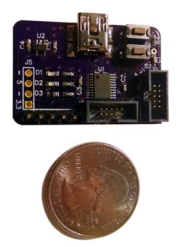

# dap42-hardware
Hardware design files for the dap42 debug probe.

Bare PCBs can be ordered from [OSHPark](https://oshpark.com/shared_projects/DoRvlUH0)

See https://github.com/devanlai/dap42 for firmware source code.

Both original DipTrace CAD files and gerber production files are included. For convenience, a PDF of the schematic and PNG renders of the top and bottom side of the board are included.

# Parts
* 1x STM32F042F6 (TSSOP-20)
* 2x 0.05" 2x5 SWD headers, one for debugging the target, one for debugging the probe (optional)
* 1x mini-USB type B connector
* 1x 5V -> 3.3V linear regulator (MIC5504-3.3YM5)
* 2x 3mm momentary pushbuttons for reset and bootloader (optional)
* 3x LEDs (optional, but fun to look at)

See the [bill of materials](BOM.md) for a more detailed list.

# License

To the extent possible under law, Devan Lai has waived all copyright and related or neighboring rights to the dap42 schematic, PCB layout, and associated CAD and gerber production files. This work is published from: United States.
